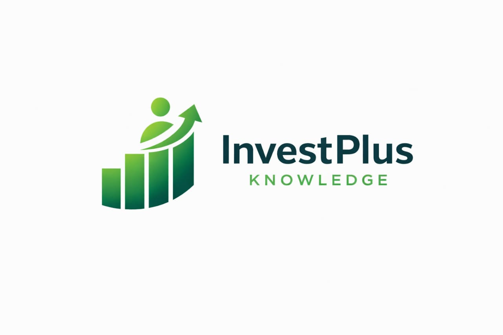

<div align="center">
  <table>
    <tr>
      <td bgcolor="white" align="center">
        
      </td>
    </tr>
  </table>
  
  # InvestPlus Knowledge Platform

[](https://reactjs.org/)
[](https://vitejs.dev/)
[](https://www.typescriptlang.org/)
[](https://www.framer.com/motion/)
[](https://www.i18next.com/)
[](https://tailwindcss.com/)

</div>

---

## Overview

**InvestPlus Knowledge** is a next-generation Business Intelligence and Investment platform. Developed with a focus on high-end aesthetics and cutting-edge performance, it serves as a central hub for investors and businesses to gain AI-driven insights, generate high-impact content, and manage investment projects with precision.

The platform is designed to be **dynamic, interactive, and globally accessible**, featuring full multi-language support and a premium user experience.

---

## Pro Features

### 1.  Dynamic Announcement Hub

The Hero section is transformed into a live news feed.

- **Automated Slider**: Smooth 8-second auto-play cycles.
- **Manual Navigation**: Vibrant green gradient buttons with spring-based hover effects.
- **Directional Transitions**: Announcements slide in/out based on navigation direction for an organic feel.
- **Fully Localized**: Every announcement is instantly translatable.

### 2.  AI-Powered Insights & Generator

- **Gemini 1.5 Pro Integration**: Real-time analysis of business metrics and dashboard data.
- **Content Studio**: Generate marketing copies, project descriptions, and growth strategies instantly.
- **Interactive Assistant**: A dedicated AI sidekick for real-time query handling.

### 3.  Global Reach (i18n)

- **Three Core Languages**: Full support for **English**, **French**, and **Arabic**.
- **Adaptive Layouts**: Automatic **RTL (Right-to-Left)** switching for Arabic.
- **Translated Metadata**: Everything from section titles to footer links and news content is localized.

### 4.  Premium Design & Animations

- **Smart Navbar**: Intelligently hides on scroll to maximize screen space; reveals elegantly with a blur-scale effect on hover.
- **Section Reveal**: Sophisticated "Blur-to-Clear" entrance animations as you scroll down the page.
- **Micro-interactions**: Icon buttons that subtly "pull" toward the cursor for a tactile feel.
- **Emerald Palette**: A custom-crafted design system using Emerald, Deep Teal, and Amber highlights for maximum visibility.

### 5.  Advanced Dashboard

- **Interactive Visualization**: High-performance charts powered by Recharts.
- **Project Tracking**: Dedicated modules for managing members, experts, and investment projects.
- **Admin Center**: A centralized view for high-level technical management.

---

## Technology Stack

- **Framework**: React 19 (Latest) + Vite
- **Language**: TypeScript (Strict Mode)
- **Styling**: Tailwind CSS with custom Design Tokens
- **Animations**: Framer Motion (Orchestration & Spring Physics)
- **AI Backend**: Google Gemini AI (Vertex AI/AI Studio)
- **State & I18n**: i18next & react-i18next
- **Charts**: Recharts

---

## Getting Started

### Prerequisites

- **Node.js**: v18.0.0 or higher
- **NPM**: v9.0.0 or higher

### Installation

1.  **Clone the platform:**

    ```bash
    git clone https://github.com/brahimmihoubi/invest_plust_knowledga.git
    cd invest_plust_knowledga
    ```

2.  **Install dependencies:**

    ```bash
    npm install
    ```

3.  **Configure AI:**
    Create a `.env` file in the root:

    ```env
    VITE_GEMINI_API_KEY=your_google_gemini_api_key
    ```

4.  **Launch:**
    ```bash
    npm run dev
    ```

---

## Project Architecture

```text
├── components/
│   ├── ui/              # Atom-level components (IconButton, SectionReveal)
│   ├── Navbar/          # Smart navigation logic
│   └── Sections/        # Modular landing page segments
├── services/
│   ├── geminiService.ts # AI logic
│   └── announcementService.ts # News data management
├── views/               # Page-level compositions
├── i18n/                # Language resources (EN, FR, AR)
├── types/               # Unified TypeScript interfaces
└── public/              # Optimized static assets
```

---

## Contributing

We are constantly refining the InvestPlus experience. Feel free to open issues or submit PRs to enhance the platform's capabilities.

## License

InvestPlus Knowledge is open-source software licensed under the **MIT License**.

---

<!-- <div align="center">
  Built with ❤️ for the future of Investment.
</div> -->
